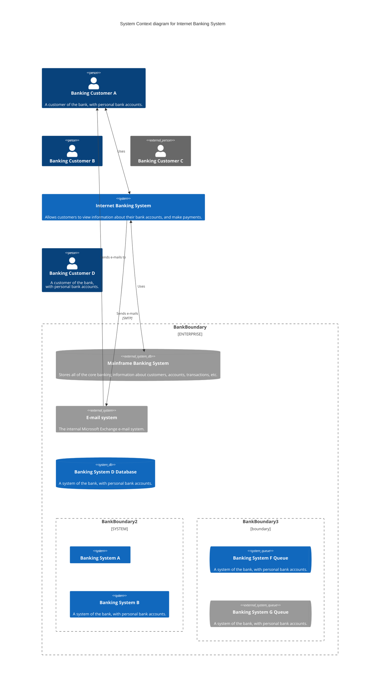

## Abstract
Tools for future projects.
- https://kroki.io
- https://github.com/mermaid-js/mermaid
- https://docs.swimm.io

```mermaid
---
title: CJaffaVM Class
---
classDiagram
	class CJaffaVM{
		+0x100 jj
	}
    CJaffaVM <|-- Rance_IX
    CJaffaVM <|-- vm_ip
    CJaffaVM <|-- vm_topmost
    class Rance_IX{
        +0x12 beakColor
    }
    class vm_ip{
	    +0x00 bytecode
	    +0x02 argument (optional)
    }
    class vm_topmost{
    }
	class Rance_IX internal-link;
```



